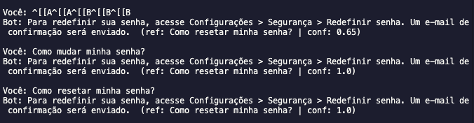

# Chatbot de Suporte (Usando busca híbrida BM25 + FAISS)

    Um exemplo mínimo e funcional de chatbot de suporte ao cliente usando busca híbrida:
    Combina busca lexical (BM25) com busca semântica (FAISS + Sentence Transformers).

### Visão geral
	•	BASE_CONHECIMENTO: lista de pares pergunta/resposta.
	•	BM25: busca por palavras exatas.
	•	FAISS + embeddings: entende similaridade semântica.
	•	Score híbrido: HIBRIDO = α * VETORIAIS + (1-α) * LEXICAIS.

### Pré-requisitos
	•	Python 3.9+
	•	Pacotes:

    pip install -r requeriments.txt

    Na primeira execução, o modelo de embeddings (all-MiniLM-L6-v2) é baixado.

### Executando
	1.	Salve o script como main.py (o código que te enviei).
	2.	Rode:

    python main.py

	3.	Faça perguntas no terminal (digite sair para encerrar).
#### Exemplos:
	•	esqueci minha senha
	•	formas de pagamento
	•	falar com atendente

### Ajustes rápidos
	•	Conhecimento: edite BASE_CONHECIMENTO:

    BASE_CONHECIMENTO = [
    {"pergunta": "Como resetar minha senha?", "resposta": "Vá em Configurações > Segurança..."},
    {"pergunta": "Quais formas de pagamento?", "resposta": "Cartão, Pix e boleto."},
    ]

	•	Peso híbrido: altere alpha em hybrid_search(..., alpha=0.65)
	•	Maior alpha → mais semântico
	•	Menor alpha → mais lexical
	•	Top-k: mude k para retornar mais de uma resposta candidata.

### Estrutura (variáveis PT-BR)
	•	BASE_CONHECIMENTO: dados de FAQ.
	•	DOCUMENTOS: textos concatenados (pergunta + resposta) para indexação.
	•	BM25: índice lexical.
	•	MODELO / EMBEDDINGS: embeddings de DOCUMENTOS.
	•	INDICE (FAISS): índice vetorial.
	•	hybrid_search(query, k, alpha): ranking híbrido.
	•	answer(query): devolve melhor resposta e confiança.

### Como funciona (resumo)
	1.	Lexical: BM25 pontua por termos exatos da query.
	2.	Semântico: FAISS busca pelos vetores mais próximos.
	3.	Normalização: ambos os escores são trazidos para 0..1.
	4.	Combinação: mistura pelos pesos alpha e 1-alpha.
	5.	Ranking final: retorna top-k.

    

### Extensões sugeridas
	•	Carregar a base de FAQ de CSV/JSON.
	•	Expor uma API com FastAPI.
	•	Logar sessões e métricas de acerto.

### Problemas comuns
	•	CUDA/torch: se não tiver GPU, tudo roda em CPU (mais lento, porém OK).
	•	Timeout no download do modelo: tente novamente ou troque o modelo por outro do sentence-transformers.

### Licença

    Uso educacional. Use livremente como quiser, para o que quiser, melhore como quiser.
